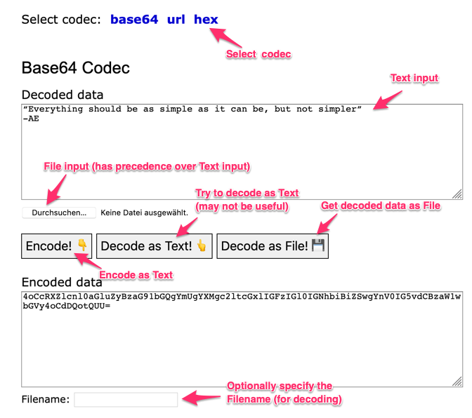

# CodecTool

A (very) simple Python/Bottle Web application (that requires very few resources) to encode/decode data with different codecs.
The application listens on port 8080 and can be easily run as local service. 

**Motivation**

- Online tools are convenient and omnipresent, but it is not always clear who can read the input data. This is especially true for server-based en/decoders (just like this tool). One must have a lot of faith in the service provider. For senistive information, online tools are simply not acceptable.
- Local tools are secure and safe, but one needs to install them and learn the snytax separately for each tool. The usage can even be different per OS. (e.g. base64 Linux vs MacOS)

## Limitations / Precautions

- If run as local service (on your workstation) the access to the service should be restricted to localhost to prevent unwanted requests. This can be achieved by one of these options...
    - changing the Python code to `run(host='127.0.0.1', port=8080)`
    - restricting access with docker to localhost: `docker run -d --restart=always --name=codectool -p 127.0.0.1:8080:8080 codectool`
- The File Upload function is basically unprotected: Too large files can crash the service. This could be mitigated by using a reverse proxy that can limit the max_body_size of an http request (e.g. nginx).
- If a transformation fails (e.g. the provided encoded data can not be decoded with the chosen codec), the service will currently display an internal error message.

## Use with Phyton

Prerequisite: Python 3 environment

    cd app && python3 app.py

## Docker Installation

Build image

    docker build -t codectool .

Simple deployment

    docker run -d --restart=always --name=codectool -p 8080:8080 codectool

For deployment as Docker Service and using a proxy, see start_services.sh as an example.

## Usage

Use application: `http://<server>:<port>`

Example:

    http://localhost:8080

